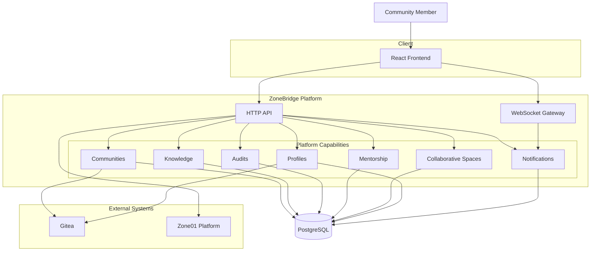

# Architecture Overview

> **Version:** 1.0
> **Status:** Draft

---

## Overview

ZoneBridge is a modular collaborative platform built for the Zone01 Kisumu community.

The platform is designed around clear architectural boundaries that prioritize maintainability, performance, security, and long-term extensibility. Rather than organizing the system around individual pages or isolated features, ZoneBridge is organized around cohesive platform capabilities that evolve independently while contributing to a unified collaborative experience.

The architecture follows a **modular monolith** approach, allowing the platform to remain simple to develop and deploy while providing clear boundaries between different areas of responsibility.

---

## Architectural Goals

The architecture is guided by the following goals:

- Simplicity
- Maintainability
- Performance
- Reliability
- Scalability
- Security
- Extensibility

Every architectural decision should contribute to one or more of these objectives.

---

## Architectural Principles

### Modular Design

The platform is divided into cohesive modules with clearly defined responsibilities.

Each module should remain independently understandable while collaborating through well-defined interfaces.

---

### Separation of Concerns

Presentation, application logic, business rules, persistence, integrations, and infrastructure remain isolated from one another.

Changes within one layer should have minimal impact on the rest of the system.

---

### Platform-Oriented Design

ZoneBridge is designed as a collaborative platform rather than a collection of pages.

Capabilities such as Communities, Knowledge, Audits, Mentorship, and Collaborative Spaces evolve independently while sharing common platform services.

---

### Integration First

ZoneBridge complements existing Zone01 services.

External systems remain the authoritative source for learning progress, repositories, authentication, and project management.

ZoneBridge focuses exclusively on collaboration.

---

### API-Driven

All platform capabilities are exposed through well-defined APIs.

Future interfaces—including mobile applications, automation, and AI assistants—will communicate through the same application layer.

---

### Event-Aware

Platform activities naturally produce events.

Examples include:

- Audit Requested
- Audit Accepted
- Community Joined
- Resource Published
- Help Request Created

These events power notifications, activity feeds, and future automation while minimizing coupling between platform capabilities.

---

### Security by Design

Security is considered throughout the architecture.

Authentication, authorization, validation, auditing, and responsible handling of community data are fundamental architectural concerns rather than implementation details.

---

## High-Level Architecture

---

## Platform Layers

The platform is organized into logical architectural layers.

### Presentation Layer

Responsible for delivering the user experience.

Responsibilities include:

- User interface
- Navigation
- Responsive layouts
- Accessibility
- User interactions

---

### Application Layer

Coordinates requests entering the platform.

Responsibilities include:

- Request handling
- Validation
- Authorization
- Workflow orchestration
- Event publishing

---

### Platform Layer

Contains the collaborative capabilities that define ZoneBridge.

Examples include:

- Communities
- Knowledge
- Audits
- Mentorship
- Collaborative Spaces
- Profiles
- Notifications

These capabilities remain independent from infrastructure concerns.

---

### Infrastructure Layer

Provides the technical services required by the platform.

Examples include:

- PostgreSQL
- Authentication
- Gitea Integration
- WebSockets
- Logging
- Configuration

Infrastructure exists to support the platform rather than define it.

---

## External Integrations

ZoneBridge integrates with external systems where appropriate while preserving clear ownership boundaries.

Current integrations include:

- Zone01 Platform
- Gitea

Future integrations may include:

- GitHub
- GitLab
- Discord
- Slack
- AI Services

External systems remain isolated behind dedicated integration components.

---

## Scalability

ZoneBridge adopts a modular monolith architecture.

This approach enables:

- Independent platform capabilities
- Reduced operational complexity
- Faster development
- Simplified deployment
- Clear architectural boundaries

As the platform evolves, individual capabilities may be extracted into independent services if operational requirements justify the additional complexity.

---

## Maintainability

Maintainability is achieved through:

- Modular architecture
- Clear capability boundaries
- Consistent coding standards
- Comprehensive documentation
- Automated testing
- Explicit interfaces
- Minimal coupling

Engineering decisions should prioritize long-term maintainability over short-term convenience.

---

## Related Documents

- Platform Overview
- Problem Statement
- Core Concepts
- Platform Principles
- System Architecture
- Technology Decisions