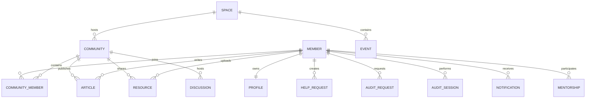

# Domain Model

> **Version:** 1.0
> **Status:** Draft

---

## Overview

The ZoneBridge domain model defines the core business entities that make up the platform and the relationships between them.

Rather than describing database tables or implementation details, this document describes the conceptual model of the platform.

The domain model provides a shared understanding for architecture, backend development, frontend development, database design, and API design.

---

## Purpose

The domain model exists to:

- Define the business entities of the platform.
- Establish ownership boundaries.
- Describe relationships.
- Create a common vocabulary.
- Guide database and API design.

---

# Platform Capabilities

The platform is organized around the following capabilities.

```text
Identity

Community

Knowledge

Collaboration

Mentorship

Audits

Collaborative Spaces

Notifications
```

Each capability owns one or more entities.

---

# Entity Ownership

| Capability | Primary Entities |
|------------|------------------|
| Identity | Member, Profile |
| Community | Community, CommunityMember |
| Knowledge | Article, Resource |
| Collaboration | HelpRequest, Discussion |
| Mentorship | MentorshipRelationship |
| Audits | AuditRequest, AuditSession |
| Collaborative Spaces | Space, Event |
| Notifications | Notification |

---

# Entity Relationships



---

# Identity

The Identity capability represents authenticated members of the ZoneBridge platform.

Entities:

- Member
- Profile

Identity information is synchronized with external authentication providers where appropriate.

---

# Community

The Community capability organizes collaboration around technical interests.

Entities:

- Community
- CommunityMember

Communities own discussions, resources, and announcements.

---

# Knowledge

The Knowledge capability preserves technical experience.

Entities include:

- Article
- Resource

Knowledge remains discoverable across cohorts.

---

# Collaboration

Collaboration enables apprentices to work together.

Entities include:

- HelpRequest
- Discussion

These entities encourage peer interaction and knowledge exchange.

---

# Mentorship

Mentorship models long-term knowledge sharing.

Entity:

- MentorshipRelationship

Mentorship relationships are collaborative rather than hierarchical.

---

# Audits

The Audit capability supports peer evaluation.

Entities include:

- AuditRequest
- AuditSession

Audit coordination complements the official Zone01 audit workflow.

---

# Collaborative Spaces

Collaborative Spaces organize community initiatives.

Entities include:

- Space
- Event

Examples include:

- Go Community
- Cybersecurity Academy
- Bootcamp
- Hackathon
- Workshop

---

# Notifications

Notifications communicate important platform events.

Entity:

- Notification

Notifications are generated by activities occurring throughout the platform.

---

# Design Principles

Every entity should:

- Have a clearly defined owner.
- Belong to exactly one capability.
- Minimize unnecessary dependencies.
- Represent a business concept.
- Remain independent from infrastructure concerns.

---

## Related Documents

- [Platform Overview](../platform/platform-overview.md)
- [Core Concepts](../platform/core-concepts.md)
- [Architecture Overview](architecture-overview.md)
- [System Architecture](system-architecture.md)