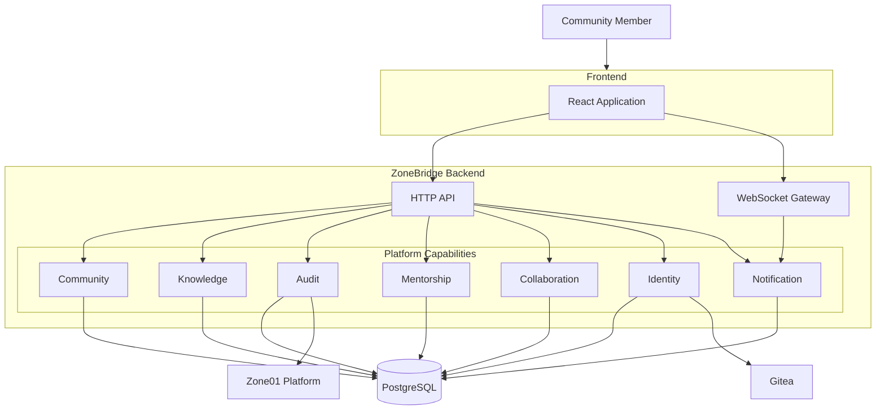
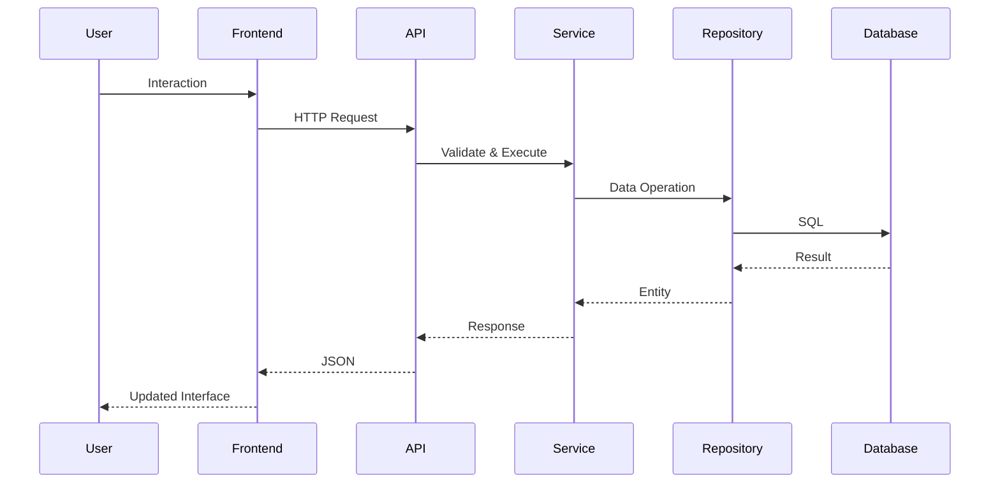
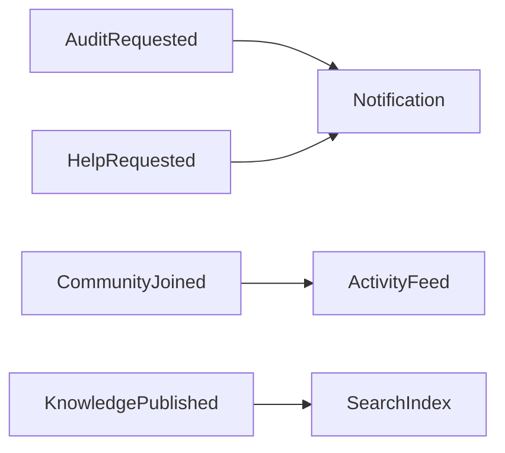

# System Architecture

> **Version:** 1.0
> **Status:** Draft

---

## Overview

This document describes the internal organization of the ZoneBridge platform.

While the Platform Overview defines **what** ZoneBridge is and **why** it exists, this document defines **how the software is structured**.

The architecture emphasizes modularity, clear ownership, testability, maintainability, and long-term evolution.

ZoneBridge is implemented as a **modular monolith**, where platform capabilities remain independent while sharing a common runtime, deployment, and database.

---

## Purpose

The objectives of the system architecture are to:

- Provide clear architectural boundaries.
- Minimize coupling between capabilities.
- Encourage maintainable code.
- Simplify testing.
- Support future platform growth.
- Reduce operational complexity.

---

## Architectural Style

ZoneBridge adopts a **Modular Monolith** architecture.

The platform is deployed as a single application while maintaining clear internal boundaries between capabilities.

This approach provides the simplicity of a monolith together with many of the organizational benefits commonly associated with distributed systems.

---

## Guiding Principles

### Capability-Oriented Organization

The system is organized around platform capabilities rather than technical layers.

Each capability owns its:

- HTTP handlers
- Business logic
- Persistence
- Validation
- Tests
- Models

---

### Single Responsibility

Every package should have one clearly defined responsibility.

A package should exist for one reason only.

---

### Explicit Dependencies

Dependencies between capabilities should be intentional and easy to understand.

Hidden coupling should be avoided.

---

### Testability

Business logic should remain independent from transport and infrastructure.

Every capability should be testable without requiring an HTTP server.

---

### Infrastructure Independence

Infrastructure supports the platform but does not define it.

Business logic should not depend directly on implementation details such as:

- Gin
- PostgreSQL
- WebSockets
- External APIs

---

## System Overview



---

## Backend Organization

The backend is organized around capabilities.

Each capability contains everything required to implement that area of the platform.

Example:

```text
internal/

community/

audit/

knowledge/

mentorship/

collaboration/

identity/

notification/
```

Each capability contains its own implementation.

Example:

```text
community/

handlers.go

service.go

repository.go

models.go

routes.go

service_test.go
```

Capabilities should remain cohesive and independent.

---

## Frontend Organization

The frontend follows the same philosophy.

Rather than organizing code by page, the frontend is organized around platform capabilities.

Example:

```text
src/

capabilities/

community/

audit/

knowledge/

mentorship/

profile/

shared/
```

Shared components remain isolated from capability-specific logic.

---

## Request Flow

Every request follows the same lifecycle.



---

## Event Flow

Platform activities generate events.

These events drive notifications, activity feeds, and future automation.



---

## External Integrations

External systems remain isolated from platform capabilities.

Dedicated integration components communicate with:

- Gitea
- Zone01 Platform
- Future external services

Platform capabilities should never communicate directly with third-party APIs.

---

## Testing Strategy

Every capability owns its own tests.

Testing levels include:

### Unit Tests

Business logic.

No infrastructure.

---

### Integration Tests

Database interactions.

Repositories.

Transactions.

---

### API Tests

HTTP handlers.

Authentication.

Validation.

Authorization.

---

### End-to-End Tests

Complete platform workflows.

---

## Engineering Standards

Every capability should provide:

- Clear interfaces.
- Comprehensive tests.
- Explicit dependencies.
- Minimal coupling.
- Well-defined responsibilities.

Code organization should optimize readability rather than file count.

---

## Trade-offs

The modular monolith architecture intentionally favors simplicity over distribution.

Advantages include:

- Easier deployment.
- Simpler debugging.
- Lower operational overhead.
- Faster local development.
- Easier onboarding.

If future scaling requirements justify distributed services, existing capability boundaries provide a natural migration path.

---

## Related Documents

- [Platform Overview](../platform/platform-overview.md)
- [Problem Statement](../platform/problem-statement.md)
- [Core Concepts](../platform/core-concepts.md)
- [Platform Principles](../platform/platform-principles.md)
- [Architecture Overview](architecture-overview.md)