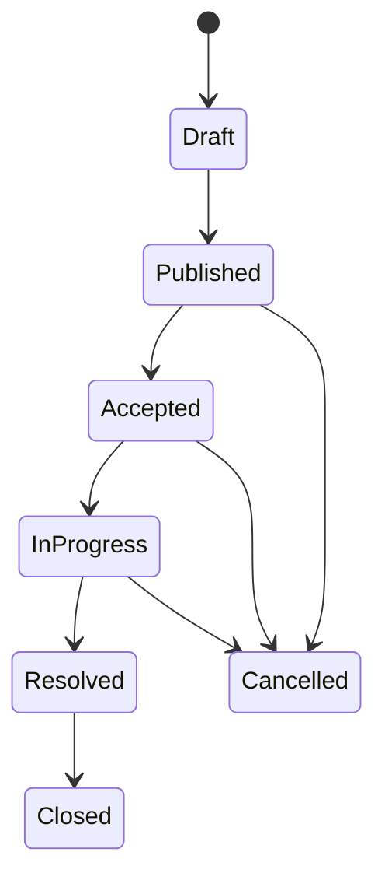
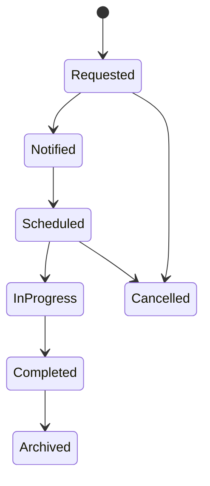
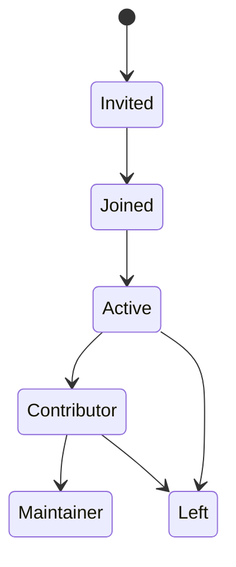
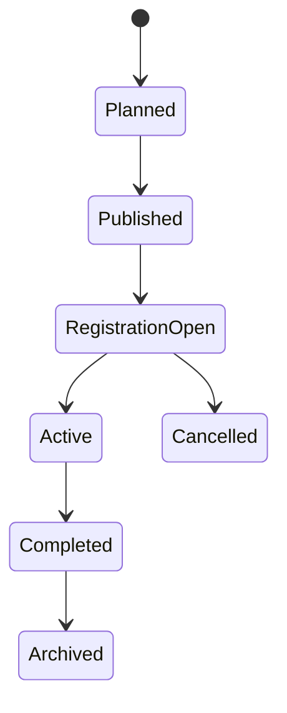
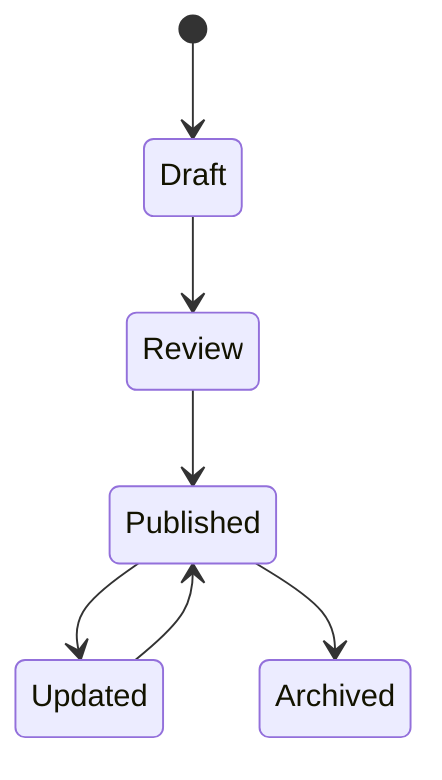
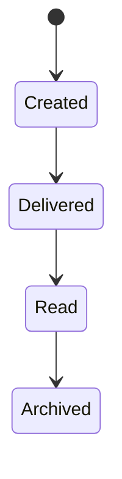
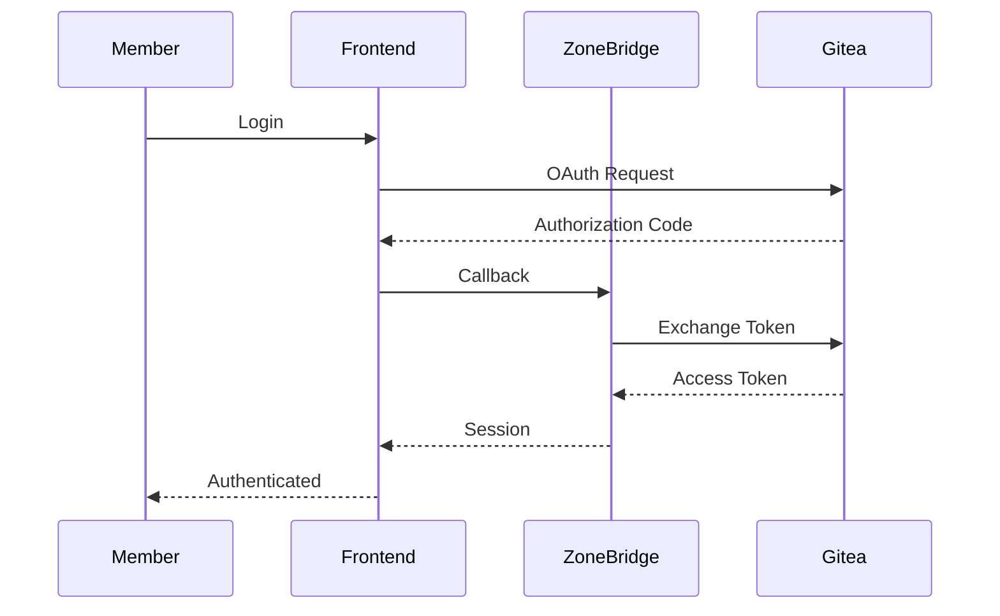
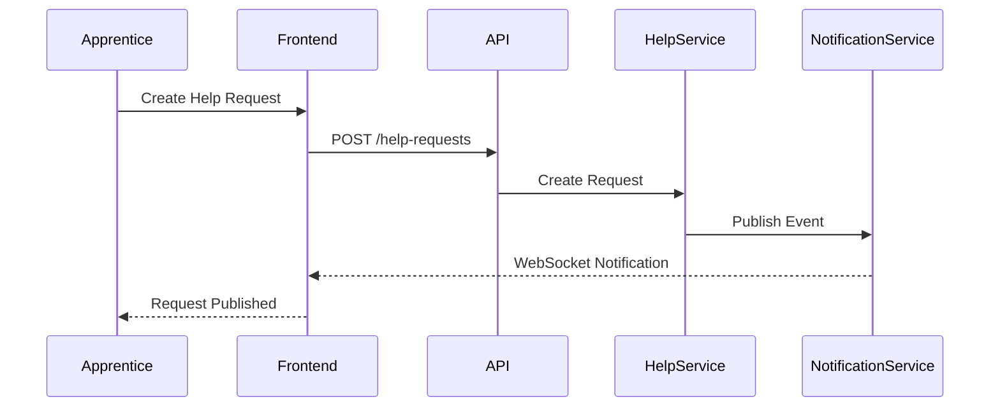
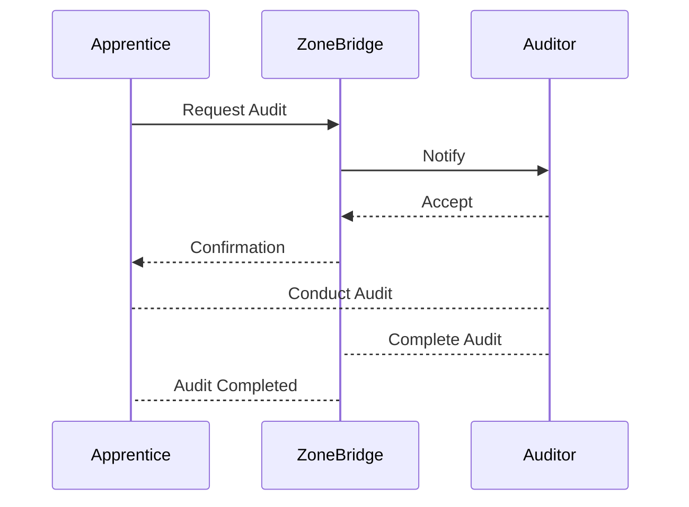

# Workflows

> **Version:** 1.0
> **Status:** Draft

---

## Overview

This document describes the primary workflows that exist within the ZoneBridge platform.

While the Domain Model defines the entities that make up the platform, this document describes how those entities evolve over time through well-defined lifecycle states and interactions.

Understanding these workflows ensures consistent implementation across the backend, frontend, APIs, and future integrations.

---

## Purpose

The objectives of this document are to:

- Define entity lifecycles.
- Describe platform interactions.
- Establish valid state transitions.
- Guide backend service implementation.
- Support frontend state management.
- Provide a reference for automated testing.

---

# Workflow Principles

Every workflow within ZoneBridge should:

- Have a clearly defined starting point.
- Contain explicit state transitions.
- Prevent invalid transitions.
- Produce meaningful events.
- Remain deterministic.
- Be fully testable.

---

# Help Request Workflow

A Help Request represents a structured request for assistance.

## Lifecycle

---

## Events

- HelpRequestCreated
- HelpRequestPublished
- HelpRequestAccepted
- HelpRequestResolved
- HelpRequestClosed
- HelpRequestCancelled

---

# Audit Workflow

Audit coordination is one of the core collaborative workflows within ZoneBridge.

## Lifecycle

---

## Events

- AuditRequested
- AuditorNotified
- AuditScheduled
- AuditStarted
- AuditCompleted
- AuditArchived

---

# Community Membership Workflow

Community participation evolves over time.

---

# Collaborative Space Workflow

Collaborative Spaces include bootcamps, hackathons, study groups, workshops, and technical communities.

---

# Knowledge Publishing Workflow

Knowledge should evolve through review before becoming discoverable.

---

# Notification Workflow

Notifications are generated automatically by platform events.

---

# Authentication Workflow

---

# Help Request Interaction

---

# Audit Coordination

---

# Platform Events

Platform workflows generate events.

These events drive:

- Notifications
- Activity Feed
- Analytics
- Future Automation
- AI Assistants
- Search Indexing

Typical events include:

- CommunityJoined
- HelpRequested
- AuditRequested
- KnowledgePublished
- EventCreated
- MentorshipStarted

---

# Engineering Guidelines

Every workflow should satisfy the following requirements:

- State transitions must be validated.
- Invalid transitions must be rejected.
- Business rules belong in services.
- Workflows should remain transport-independent.
- Events should be published after successful state changes.
- Every workflow should have comprehensive unit and integration tests.

---

## Related Documents

- [Platform Overview](../platform/platform-overview.md)
- [Core Concepts](../platform/core-concepts.md)
- [Architecture Overview](architecture-overview.md)
- [System Architecture](system-architecture.md)
- [Domain Model](domain-model.md)