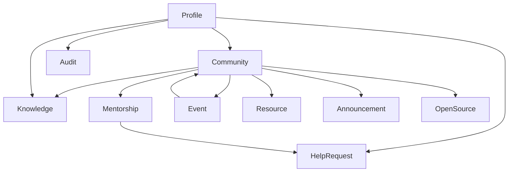

# Core Concepts

> **Version:** 1.0
> **Status:** Draft

---

## Overview

ZoneBridge is organized around a set of core concepts that define the platform.

These concepts establish a shared language across the project and serve as the foundation for the platform's architecture, data model, APIs, and user experience.

Every capability within ZoneBridge is built upon one or more of these concepts.

---

## Purpose

This document defines the fundamental concepts that make up the ZoneBridge platform.

Each concept represents a distinct area of responsibility within the platform rather than a technical implementation.

Together, these concepts form the collaborative experience provided by ZoneBridge.

---

# Community

A Community is a collaborative space where apprentices gather around a shared technical interest, initiative, or objective.

Communities encourage continuous learning, discussions, collaboration, and resource sharing.

Examples include:

- Go
- JavaScript
- Cybersecurity
- DevOps
- Artificial Intelligence
- Blockchain
- Open Source

Communities are long-lived and continue evolving as the platform grows.

---

# Knowledge

Knowledge represents technical information contributed by community members.

Examples include:

- Articles
- Project write-ups
- Debugging experiences
- Best practices
- Implementation notes
- Tutorials
- Technical documentation

Knowledge should remain discoverable and continue benefiting future apprentices.

---

# Audit

An Audit represents a peer evaluation performed as part of the Zone01 learning experience.

ZoneBridge supports audit coordination by helping apprentices:

- discover assigned auditors
- communicate availability
- request evaluations
- organize audit sessions

ZoneBridge complements the official audit workflow rather than replacing it.

---

# Help Request

A Help Request is a structured request for assistance.

Unlike general messaging, help requests provide context such as:

- topic
- technology
- project
- description

This allows community members with relevant expertise to provide targeted assistance.

---

# Mentorship

Mentorship represents ongoing knowledge sharing between experienced and developing apprentices.

Mentorship within ZoneBridge emphasizes peer learning rather than formal instructor-led teaching.

Relationships may be short-term or long-term depending on community needs.

---

# Event

An Event represents a scheduled collaborative activity within the community.

Examples include:

- Bootcamps
- Hackathons
- Workshops
- Technical Talks
- Study Sessions
- Community Meetups

Events encourage participation beyond the standard curriculum.

---

# Open Source Initiative

An Open Source Initiative represents a collaborative software project developed by members of the Zone01 community.

These initiatives encourage:

- collaboration
- contribution
- code reviews
- software maintenance
- long-term engineering

They provide practical opportunities for apprentices to apply their skills beyond curriculum projects.

---

# Profile

A Profile represents a community member within ZoneBridge.

Profiles describe participation within the platform rather than academic progress.

A profile may include:

- technical interests
- expertise
- contributions
- communities
- mentorship activity
- audit participation

The official Zone01 platform remains the authoritative source for curriculum progress.

---

# Announcement

Announcements communicate important information to the community.

Announcements may originate from:

- platform maintainers
- community organizers
- bootcamp organizers
- hackathon organizers

Announcements provide visibility into ongoing community activities.

---

# Resource

A Resource represents reusable material shared with the community.

Resources may include:

- documentation
- templates
- presentations
- code examples
- datasets
- reference implementations

Resources strengthen collaborative learning by making valuable material easily accessible.

---

# Relationships

The concepts within ZoneBridge are interconnected.

Rather than existing independently, these concepts work together to create a cohesive collaborative platform.

---

## Design Principles

Every concept within ZoneBridge should:

- Have a clearly defined responsibility.
- Remain independent from implementation details.
- Integrate naturally with other concepts.
- Support long-term platform evolution.
- Encourage collaboration.

---

## Related Documents

- Platform Overview
- Problem Statement
- Platform Principles
- Architecture Overview